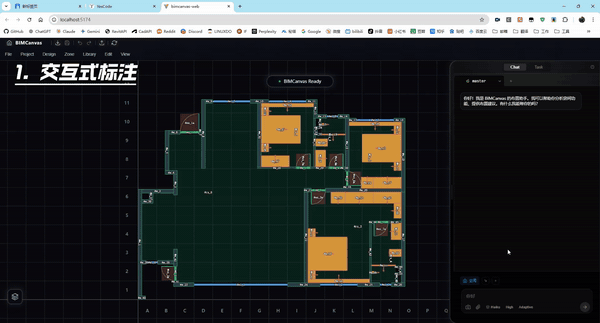

<div align="center">

# BIMCanvas

**连接 AI 与 Revit 的室内设计辅助工具**

[](LICENSE)
[](#-status)
[](https://dotnet.microsoft.com/)
[](https://www.python.org/)
[](https://vuejs.org/)

[Documentation](docs/README.md) · [Architecture](docs/Architecture.md) · [在线总览](https://bimcanvas.com/bimcanvas-overview.html)

</div>

---



## ⚠️ Status

**Pre-release.** Phase 1–3 已实现并可用：Revit → JSON 导出、AI 决策、Web 实时画布、多策略 Git 分支。Phase 4（Revit 双向同步 / 方案回写到 Revit）正在开发中。

- ✅ 适合：本地体验、二次开发、集成实验、内部研究
- ❌ 不建议：生产部署、关键设计交付

## Why BIMCanvas

Revit 里改一处家具，往往要走"找族 → 选参数 → 调位置 → 对齐 → 刷视图"五个动作——设计师的大块时间消耗在重复制图上。BIMCanvas 让 AI 接管这部分：你写自然语言，AI 落出符合空间逻辑的家具方案，Web 上直接调整，最终回到 Revit 作为可编辑的 BIM 模型。所有项目数据以 Git 仓库形式管理，多方案通过分支隔离，决策可追溯、可回滚。

## Quick Start

### Prerequisites

- [.NET 8 SDK](https://dotnet.microsoft.com/download/dotnet/8.0)
- [Node.js](https://nodejs.org/) ≥ 18
- [Python 3.10+](https://www.python.org/)（Agent 服务）
- [Git](https://git-scm.com/)

### Run（开发态）

```bash
git clone <repo-url>
cd BIMCanvas
dotnet run --project BIMCanvas.Server
```

默认行为：

- Server API → `http://localhost:5000`
- Web 前端 → `http://localhost:5173`（自动打开浏览器）
- Agent 服务后台启动（统一经 Server `/agent` 代理）

首次启动会在 `%USERPROFILE%\Documents\BIMCanvas\` 下生成配置模板。LLM Provider 的 `apiKey` / `baseUrl` 写入 `config.dev.local.json`（或在设置 UI 里填）；CCR 路由配置写入 `ccr_config.dev.local.json`。

### 其他启动模式

- **Windows 发布态**：`dotnet publish BIMCanvas.Server -c Release -o publish`，双击 `publish/BIMCanvas.Server.exe`
- **Linux Docker**：见 [docs/Doc_Docker_Linux_Deployment.md](docs/Doc_Docker_Linux_Deployment.md)

## Features

- **自然语言 → 家具布置方案**：AI 解析意图，Server 计算几何，结果落盘为 JSON
- **多 LLM Provider 适配**：Claude / GPT / Gemini / DeepSeek 等通过 ProviderAdapter 接入
- **Git 分支 × 多方案并行**：策略走分支、SubAgent 走 Worktree，多个 AI 同时设计互不冲突
- **三层文件驱动架构**：`baseline/` 只读 · `computed/` 派生 · `schemes/` 可写——详见 [Schema](docs/Schema.md)
- **2.5D Web 画布**：Vue 3 + Three.js 实时编辑，人机协作
- **Canvas-MCP 工具接口**：Agent 与 Server 之间标准化通信——详见 [Arch_MCP_Tools](docs/Arch_MCP_Tools.md)
- **Revit 双向同步**：导出（→ `.bcp`）已实现；回写到 Revit 在 Phase 4
- **Git 原生版本管理**：每次 AI 决策进 Git 历史，可追、可 diff、可回滚

## Architecture

五个子系统协作，通过 REST / SignalR / SSE / MCP 互联：

| 子系统 | 职责 | 运行时 |
|---|---|---|
| [**Core**](BIMCanvas.Core/README.md) | 数据模型 · 空间算法（碰撞 / 验证 / Zone） | .NET Standard 2.0 |
| [**Server**](BIMCanvas.Server/README.md) | 状态管理 · 几何计算 · Git Worktree · 通信中枢 | .NET 8 |
| [**Agent**](BIMCanvas.Agent/README.md) | AI 决策 · 意图解析 · Skill 工作流 | Python 3.10+ |
| [**Web**](BIMCanvas.Web/README.md) | 画布渲染 · 拖拽编辑 · AI 对话 UI | Vue 3 + TypeScript |
| [**Revit**](BIMCanvas.Revit/README.md) | 户型导出 · 方案回写 (WIP) | .NET FW 4.7.2 |

详细架构：[docs/Architecture.md](docs/Architecture.md) · [.bcp 项目格式](docs/Schema.md) · [Agent 设计](docs/Agent_Design.md)

## Project Structure

```
BIMCanvas/
├── BIMCanvas.Core/             数据模型 + 空间算法
├── BIMCanvas.Server/           REST + SignalR + SSE + Canvas-MCP
├── BIMCanvas.Agent/            AI 决策（Python）
├── BIMCanvas.Web/              Vue 画布前端
├── BIMCanvas.Revit/            Revit 插件
├── BIMCanvas.ProviderAdapter/  LLM Provider 适配层
├── docs/                       架构 / 设计 / 工作流文档
├── deploy/                     Docker 编排
└── demos/                      示例 .bcp 项目
```

## Documentation

| 主题 | 文档 |
|---|---|
| 整体架构 | [docs/Architecture.md](docs/Architecture.md) |
| `.bcp` 项目格式 | [docs/Schema.md](docs/Schema.md) |
| Agent 决策模型 | [docs/Agent_Design.md](docs/Agent_Design.md) |
| Agent 工作流 | [docs/Agent_Workflows.md](docs/Agent_Workflows.md) |
| Canvas-MCP 工具 | [docs/Arch_MCP_Tools.md](docs/Arch_MCP_Tools.md) |
| Git Worktree 并行 | [docs/Arch_Parallel_Development.md](docs/Arch_Parallel_Development.md) |
| Docker 部署 | [docs/Doc_Docker_Linux_Deployment.md](docs/Doc_Docker_Linux_Deployment.md) |
| 完整索引 | [docs/README.md](docs/README.md) |

## Roadmap

- ✅ 文件驱动 `.bcp` 项目格式
- ✅ 主控 Agent + Skill 工作流
- ✅ 语义方案三段链路（spatial-skeleton → strategic-plan → construction-brief）
- ✅ 参考分析（v1 客观 → v4+ 修订）
- ✅ 网格选择集
- 🔶 Git Worktree 多方案并行（开发中）
- 🔶 Server Docker 化部署（开发中）
- ⬜ 多分区并行派发稳态化
- ⬜ 可视化 / 选择性合并
- ⬜ Revit 双向同步（Phase 4 — 回写家具到 Revit）

## Contributing

欢迎 PR 与 Issue 反馈。当前尚无正式 `CONTRIBUTING.md`——可以从 [docs/README.md](docs/README.md) 入手熟悉架构，或在 Issues 里讨论想法。

## License

[Apache License 2.0](LICENSE) · Copyright 2026 BIMCanvas Contributors
