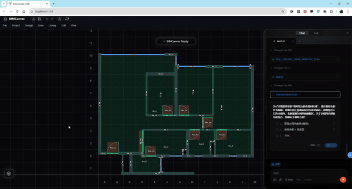
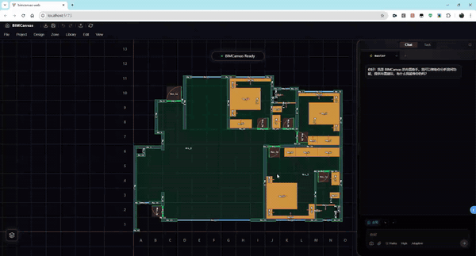
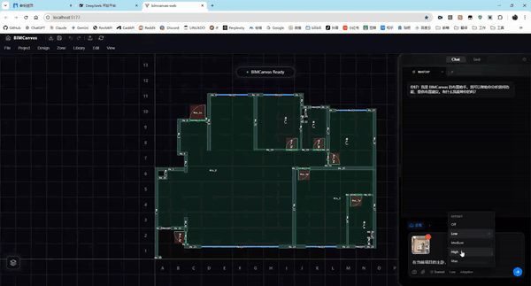
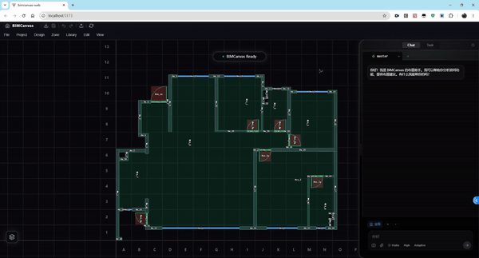
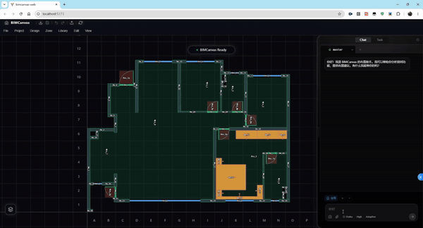

<div align="center">

# BIMCanvas

**把自然语言变成可编辑的 Canvas 方案**

_Vibe Drafting · 凭感觉起方案，让 AI 完成制图_

[](LICENSE)
[](https://dotnet.microsoft.com/)
[](https://www.python.org/)
[](https://vuejs.org/)

[在线总览](https://bimcanvas.com/bimcanvas-overview.html) · [架构文档](docs/Architecture.md) · [项目格式](docs/Schema.md) · [Agent 设计](docs/Agent_Design.md)

</div>

---

BIMCanvas 是一款连接 AI 与 Revit 的室内设计辅助工具。它解析自然语言指令，自动生成符合空间逻辑的家具布置方案，并允许设计师在 Web 端实时调整，最终直接输出为可编辑的 Revit BIM 模型。

> 让设计师把省下的时间，用回到设计本身。


---

## 设计师的一天：10% 设计，90% 制图

> "重新摆下主卧。"——你脑里 10 分钟想完，Revit 里要走 5 步：找族、选参数、调位置、对齐、刷视图——一上午就这么没了。

| | 占比 | 价值 |
|---|---|---|
| **制图** | 90% | 重复劳动 |
| **设计** | 10% | 创造与判断 |

设计师的精力，不该消耗在前者。

---

## Vibe Drafting：设计师不再画图

2025 年开始流行的 **Vibe Coding**——程序员说一句话，AI 写代码。
BIMCanvas 把这套工作方式带给设计师——你做 10% 的设计，AI 做 90% 的制图。

| Vibe Coding · for developers | Vibe Drafting · for designers |
|---|---|
| 你："实现个登录功能" | 你："主卧加点收纳" |
| AI：写完了 | AI：摆完了 |
| 你："按钮太小" | 你："柜子矮点" |
| AI：改完了 | AI：改完了 |

无论是代码，还是空间。

---

## 功能演示

### 主动提问 · 把推理亮出来，请你点一下

AI 不是只丢一句"你想要哪个"——它会把为什么在这里停下来、几条路各通向哪儿、自己倾向哪条都写清楚；你看得见它的思路，也能改主意或自己写一条。



> 默认推荐第一项，回车采纳；不想被打断按 ESC 忽略，AI 自己按推荐继续——选了哪一条、为什么这么选都会落进文件、进 Git 历史。

### 网格选择 · 给 AI 一个明确的几何范围

在画布上圈一块、写一句描述——AI 就知道你说的"这里"是哪里。比"左边那块"或"靠窗的角落"精确得多。



> 网格只用来圈选、不写进项目；可以同时圈多块、随手清空，断网时草稿不丢。

### 参考分析 · 上传一张参考图，AI 替你写设计简报

把你喜欢的房型图扔进来，AI 帮你把它"读懂"——一稿写客观的设计要素，二稿对照你这套户型，三稿你拍板定调。



> 三稿都留着，后续规划永远读你拍板的那一版；要换参考图，得过你这关，AI 不会偷偷改。

### 多方案并行 · 同一个房间，AI 同时画 3 种摆法

说一句"为主卧多设计几种"——AI 只写一次空间骨架，然后派出几个分身，各自跑完战略到布置。结果摆桌上，你肉眼挑。



> 几个变体共用空间骨架、共用房间分区，只在家具摆法上分叉——同根同源，比较起来不打架；采纳一个，其它保留以备切换。

### 局部重生成 · 一件家具不顺眼，AI 重跑两版给你挑

圈出梳妆台说"换个地方"——AI 在这个房间里重新跑两版布局（允许跨房间连带调整），每版都跑通碰撞自检才呈给你。



> 不只是挪一件家具——AI 会按规则推导连带要让位的其他家具；不评分、不排序，由你肉眼比较哪版更顺眼。

---

## 架构总览

五大子系统：**骨血心脑眼，加一只手臂**。每个子系统跑在最适合它的运行时上，靠 REST + SignalR + SSE + MCP 把彼此粘合起来。

| 子系统 | 角色 | 职责 | 运行时 |
|---|---|---|---|
| [**Core**](BIMCanvas.Core/README.md) | 骨骼 | 数据模型 · 空间算法 | .NET Standard 2.0 |
| [**Server**](BIMCanvas.Server/README.md) | 心脏神经 | REST · SignalR · SSE · Canvas-MCP | .NET 8 |
| [**Agent**](BIMCanvas.Agent/README.md) | 大脑 | 主控 + SubAgent · Skill 工作流 | Python 3.10+ |
| [**Web**](BIMCanvas.Web/README.md) | 眼睛皮肤 | 画布渲染 · 实时编辑 | Vue 3 + TypeScript |
| [**Revit**](BIMCanvas.Revit/README.md) | 手臂 | 户型导出 · 方案回写 | .NET Framework 4.7.2 |

### 三个工程选择

| 维度 | 选择 | 为什么 |
|---|---|---|
| **数据** | 文件即真理 | 业务数据全部以 JSON 落在 `.bcp` 项目目录，Server 不持内存状态、只做"读取-聚合-分发"。改动追溯走 Git，不靠 DBA。 |
| **职责** | 智能与计算分家 | AI 决定"放哪儿"，Server 算"放得下吗"——意图归 Agent，几何归 Server。这条边界一旦让步，碰撞错误就开始反复。 |
| **协作** | 一切并行 | 多策略走 Git 分支，多 SubAgent 走 Worktree 物理隔离。同一个 `.git/`，三个 AI 同时设计三个方案，写不串。 |

详细架构文档：[docs/Architecture.md](docs/Architecture.md)

---

## .bcp 项目格式：三层汉堡

一个项目 = 一个 Git 仓库。三层权限不同，三个角色（Revit / Server / AI+Web）各管一层——分得清楚，改了什么就追得清楚。

| 层 | 目录 | 内容 | 权限 |
|---|---|---|---|
| 派生 | `computed/` | room_zones · exclusions（禁区） | Server 自动生成，不要手改 |
| 方案 | `schemes/{strategyId}/` | strategy · zones · finishes · modules · semantic_plan | AI / Web / Server 可写，多策略走 Git 分支 |
| 基础 | `baseline/` | architecture · openings · rooms · location_lines | Revit 导出，只读，哈希校验防篡改 |

辅助层 `references/`（设计规则）和 `modules/`（模块素材库）随项目一起初始化。

详细 Schema：[docs/Schema.md](docs/Schema.md)

---

## 快速开始

### 环境要求

- [.NET 8.0 SDK](https://dotnet.microsoft.com/download/dotnet/8.0)
- [Node.js](https://nodejs.org/)（用于 Web 前端）
- [Git](https://git-scm.com/)
- [Python 3.10+](https://www.python.org/)（用于 Agent 服务）
- [Docker Desktop / Docker Engine](https://www.docker.com/)（仅 Linux 部署需要）

### 启动模式 1：Windows 开发态

```bash
dotnet run --project BIMCanvas.Server
```

默认行为：

- 启动 Server API：默认首选 `http://localhost:5000`（由 `<BIMCANVAS_HOME>/server_config.json > server.port` 管理），仅当前候选端口上的本项目历史 Server 进程会被清理复用；其他仍运行的 BIMCanvas 实例或外部进程会顺序避让到下一个可用端口
- 自动拉起 Web 开发服务器：默认首选 `http://localhost:5173`（由 `server_config.json > web.port` 管理），冲突时同样顺序避让
- 自动启动 Agent 服务
- Agent 开发态请求统一经由 `Server /agent` 代理转发，不再要求前端固定直连
- 自动打开浏览器

首次启动会在 `%USERPROFILE%\Documents\BIMCanvas\` 下自动创建一组安全模板，并额外生成两个开发态私有补齐文件：

- `config.dev.local.json` — 直连快测的 `baseUrl` / `apiKey`
- `ccr_config.dev.local.json` — CCR 快测的 `Providers` / `Router`

约定：

- Agent 监听端口统一由 `server_config.json > agent.port` 管理，`config.json` 不再声明 `server.host/server.port`
- 这两份 `*.dev.local.json` 只在对应运行时配置文件首次创建时作为初始化种子读取一次
- 只要 `config.json` / `ccr_config.json` 已存在，后续启动一律以运行时文件本身为准
- 它们不进仓库，也不是设置 UI 的长期真源

### 启动模式 2：Windows 本机发布态

```bash
dotnet publish BIMCanvas.Server -c Release -o publish
```

双击 `publish/BIMCanvas.Server.exe` 即可一键拉起所有服务：

| 服务 | 地址 | 说明 |
|---|---|---|
| Server API | 默认首选 http://localhost:5000 | 由 `server_config.json > server.port` 管理，冲突时自动顺序避让 |
| Web 前端 | 默认首选 http://localhost:5173 | 由 `server_config.json > web.port` 管理，自动启动并打开浏览器 |
| Agent 服务 | 后台进程 | 自动启动（需 Python 环境） |

> 发布路径必须为项目根目录下的 `publish/` 文件夹（`-o publish`）。

### 启动模式 3：Linux 服务器 Docker 部署

Docker 基线：

- `deploy/docker-compose.yml` + `deploy/docker-compose.server.yml` + `deploy/nginx.server.conf` 作为服务器编排入口
- `deploy/start.sh` 负责实例 bootstrap
- `instance.env` 只用于首次初始化与缺省值补齐
- 首页"实例设置"是实例内部应用配置的正式入口

详见 [docs/Doc_Docker_Linux_Deployment.md](docs/Doc_Docker_Linux_Deployment.md)。

---

## 项目结构

```
BIMCanvas/
├── BIMCanvas.Core/         数据模型 + 空间算法 (.NET Standard 2.0)
├── BIMCanvas.Server/       REST + SignalR + SSE + Canvas-MCP (.NET 8)
├── BIMCanvas.Agent/        MainAgent + SubAgent + Skill 工作流 (Python)
├── BIMCanvas.Web/          Vue 3 画布前端
├── BIMCanvas.Revit/        Revit 插件 (.NET FW 4.7.2)
├── BIMCanvas.ProviderAdapter/  LLM Provider 适配层
├── demos/                  示例 .bcp 项目
├── docs/                   架构 · 设计 · 工作流文档
│   ├── Architecture.md         整体架构
│   ├── Schema.md               .bcp 项目格式权威
│   ├── Agent_Design.md         Agent 决策模型
│   ├── Agent_Workflows.md      Skill 工作流细节
│   ├── Arch_MCP_Tools.md       Canvas-MCP 工具规范
│   └── ...                     更多见 docs/README.md
└── deploy/                 Docker 编排
```

每个模块的内部细节都在它自己的 README 里，上面架构总览表格已经全部链接好。

---

## 文档索引

| 主题 | 文档 |
|---|---|
| 整体架构 | [docs/Architecture.md](docs/Architecture.md) |
| `.bcp` 项目格式 | [docs/Schema.md](docs/Schema.md) |
| Agent 决策模型 | [docs/Agent_Design.md](docs/Agent_Design.md) |
| Agent 工作流 | [docs/Agent_Workflows.md](docs/Agent_Workflows.md) |
| Agent 空间推理 | [docs/Agent_Spatial.md](docs/Agent_Spatial.md) |
| Canvas-MCP 工具 | [docs/Arch_MCP_Tools.md](docs/Arch_MCP_Tools.md) |
| Git Worktree 并行 | [docs/Arch_Parallel_Development.md](docs/Arch_Parallel_Development.md) |
| Docker 部署 | [docs/Doc_Docker_Linux_Deployment.md](docs/Doc_Docker_Linux_Deployment.md) |
| 完整索引 | [docs/README.md](docs/README.md) |

---

## Roadmap

**已实现**

- 文件驱动架构与 `.bcp` 项目格式
- 主控 Agent + Skill 工作流
- 语义方案三段链路：骨架 → 战略 → 简报
- 参考分析 v1 → v4+ 演进
- 网格选择集（Space Mark）

**正在做**

- Git Worktree 多方案并行（同时试三个方案，互不打扰）
- Server 的 Docker 化部署

**接下来**

- 多分区并行派发的稳态化
- 可视化 / 选择性合并（挑你喜欢的部分，组合成最终方案）
- Revit 双向同步（Phase 4，回写家具到 Revit）

---

## 协议

[Apache License 2.0](LICENSE) · Copyright 2026 BIMCanvas Contributors
