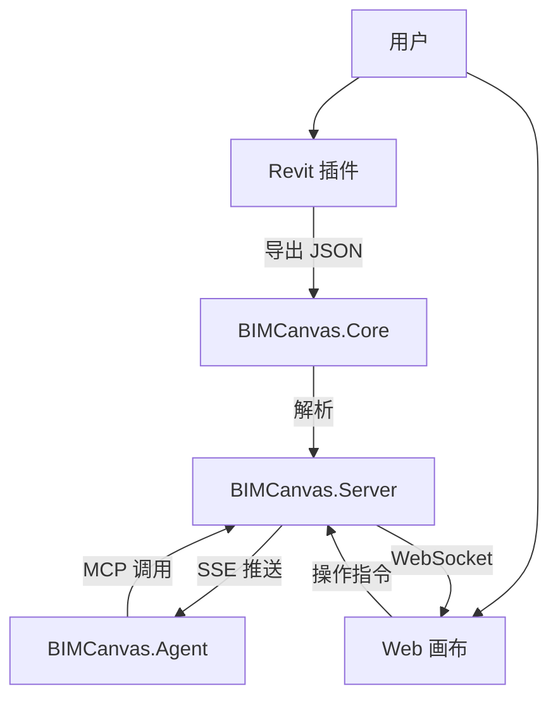

# BIMCanvas

基于 AI CLI 的室内装修平面方案设计助手，实现 Revit 与 AI 之间的人机协作设计。

> **当前版本**: v2.8 | **数据模型**: walls + columns + openings + rooms + zones + modules | **架构**: Agent SDK 集成

## 🚀 项目简介

BIMCanvas 是一个连接 Revit 和 AI 的桥梁。它通过将复杂的 BIM 数据转换为 AI 易于理解的 JSON 结构，并在 Web 端提供直观的 3D 可视化画布，让设计师能够利用 AI 的能力快速生成和迭代室内装修方案。

## ✨ 核心功能与状态

### 1. 核心数据层 (BIMCanvas.Core)
> 状态: ✅ 已完成

- **数据模型**: 定义了墙、柱、门窗、房间、区域、模块等核心对象。
- **空间算法**: 实现了碰撞检测、放置验证、多边形运算等几何算法。
- **JSON 序列化**: 提供了 Revit 数据与 Canvas JSON 格式之间的双向转换。

### 2. Revit 集成 (BIMCanvas.Revit)
> 状态: 🔶 部分完成

- ✅ **数据导出**: 支持从 Revit 导出墙体、柱子、门窗和房间数据到 JSON。
- ✅ **UI 面板**: 实现了 Ribbon 功能区和配置窗口。
- ⬜ **数据回写**: 将 AI 生成的布置方案（JSON）自动转换为 Revit 族实例（待开发）。

### 3. Web 可视化与交互 (BIMCanvas.Web)
> 状态: 🔶 进行中

- ✅ **3D 渲染**: 基于 Three.js 实现高性能的建筑模型渲染。
- ✅ **AI Vision 模式**: 专为 AI 调试设计的视觉模式，清晰展示包围盒与空间关系。
- ✅ **基础交互**: 支持平移、缩放、旋转视图。
- ✅ **对象选择**: 支持点击选择场景中的构件。
- 🔶 **拖拽编辑**: 基础拖拽框架已搭建，Ghost 系统待完善。
- ⬜ **实时协作**: 基于 SignalR 的多端同步（待开发）。

### 4. 智能布置 Agent (BIMCanvas.Agent)
> 状态: ⬜ 待开发

- ⬜ **PlacementAgent**: 基于 Anthropic Agent SDK 的智能布置逻辑。
- ⬜ **OBB 规划**: 基于包围盒（OBB）的快速空间规划算法。
- ⬜ **SSE 监听**: 监听服务端事件以触发自动设计。

### 5. 服务端 (BIMCanvas.Server)
> 状态: ⬜ 待开发

- ⬜ **MCP Server**: 提供 Model Context Protocol 接口供 AI 调用。
- ⬜ **REST API**: 提供前端所需的数据接口。
- ⬜ **事件总线**: 处理多端消息分发。

---

## 🛠️ 技术架构



## 📦 快速开始

### 前置要求
- Node.js 18+
- .NET 6.0 SDK
- Revit 2024 (用于插件开发)

### 启动 Web 前端
```bash
cd BIMCanvas.Web
npm install
npm run dev
```

### 编译 Core 类库
```bash
cd BIMCanvas.Core
dotnet build
```

## 📝 开发计划

| 阶段 | 目标 | 关键任务 | 状态 |
|------|------|----------|------|
| **Phase 1** | **核心基础** | Core 模型, Revit 导出, Web 基础渲染 | ✅ 完成 |
| **Phase 2** | **AI 接入** | Agent SDK 集成, AI Vision 模式, 基础布置 | 🔶 进行中 |
| **Phase 3** | **交互编辑** | Web 拖拽, 属性编辑, 实时同步 | ⬜ 待开始 |
| **Phase 4** | **闭环落地** | Revit 回写, 族库匹配, 完整演示 | ⬜ 待开始 |

## 📄 相关文档

- [架构文档](docs/Architecture.md)
- [产品需求文档 (PRD)](docs/PRD.md)
- [JSON 数据模型](docs/Schema-JSON.md)
