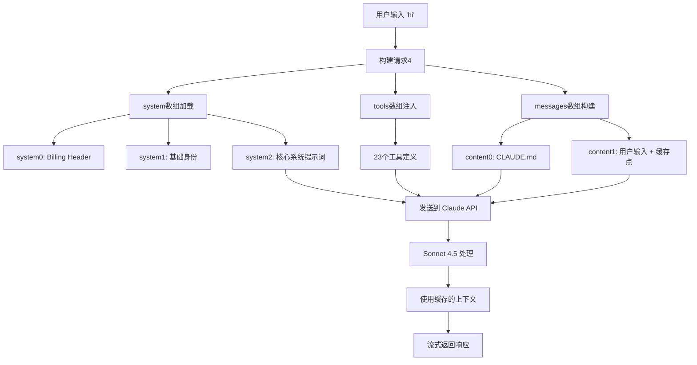

# Claude Code 请求日志结构详解

> 基于 Claude Code v2.1.17 的完整对话请求分析

---

## 一、顶层结构概览

```json
{
  "model": "claude-sonnet-4-5-20250929",  // 使用的模型
  "messages": [...],                       // 对话消息历史
  "system": [...],                         // 系统提示词
  "tools": [...],                          // 可用工具定义
  "metadata": {...},                       // 元数据
  "max_tokens": 32000,                     // 最大输出token
  "thinking": {...},                       // 思维模式配置
  "stream": true                           // 流式输出
}
```

---

## 二、messages 数组详解

### 2.1 结构层次

```json
"messages": [
  {
    "role": "user",
    "content": [
      { /* content[0]: CLAUDE.md 提示词 */ },
      { /* content[1]: 用户实际输入 */ }
    ]
  }
]
```

### 2.2 content[0]: CLAUDE.md 系统提示词

```json
{
  "type": "text",
  "text": "<system-reminder>\n...\n</system-reminder>\n"
}
```

**内容结构**:
```xml
<system-reminder>
As you answer the user's questions, you can use the following context:
# claudeMd
Codebase and user instructions are shown below...

Contents of C:\Users\huhaonan\.claude\CLAUDE.md:
┌─────────────────────────────────────────┐
│ 全局用户配置                              │
├─────────────────────────────────────────┤
│ - 开发指导原则                            │
│ - 语言规范（中文对话，英文代码）            │
│ - Git存档系统                             │
│ - 构建编译配置                            │
│ - 文档管理规范                            │
└─────────────────────────────────────────┘

Contents of E:\工作文档\开发类\MyCode\BIMCanvas\CLAUDE.md:
┌─────────────────────────────────────────┐
│ 项目特定配置                              │
├─────────────────────────────────────────┤
│ - BIMCanvas 项目指令                      │
│ - 快速导航（文档索引、模块速查）            │
│ - 核心约束（命名空间、版本规则）            │
│ - 架构速查（MainAgent、Revit）            │
└─────────────────────────────────────────┘

IMPORTANT: this context may or may not be relevant to your tasks...
</system-reminder>
```

**作用**:
- ✅ 注入用户自定义规则
- ✅ 支持**全局 + 项目级别**双层配置
- ✅ 用 `<system-reminder>` 标签包裹，提示AI这是上下文信息
- ✅ 明确标注 `OVERRIDE` 优先级（覆盖默认行为）

### 2.3 content[1]: 用户实际输入

```json
{
  "type": "text",
  "text": "hi",
  "cache_control": {
    "type": "ephemeral"  // 启用提示缓存
  }
}
```

**cache_control 的作用**:
- `ephemeral`: 临时缓存，用于减少重复处理相同上下文的成本
- Claude 会缓存这条消息**之前**的所有内容（system + tools + messages[0].content[0]）
- 后续轮次对话可以复用缓存，加快响应速度，降低成本

---

## 三、system 数组详解

### 3.1 system[0]: Billing Header

```json
{
  "type": "text",
  "text": "x-anthropic-billing-header: cc_version=2.1.17.7fe; cc_entrypoint=cli"
}
```

| 字段 | 说明 |
|------|------|
| `cc_version` | Claude Code 版本号 |
| `cc_entrypoint` | 请求来源（CLI工具） |
| **作用** | 内部计费和统计 |

### 3.2 system[1]: 基础身份

```json
{
  "type": "text",
  "text": "You are Claude Code, Anthropic's official CLI for Claude.",
  "cache_control": { "type": "ephemeral" }
}
```

- **作用**: 定义 AI 的基础角色身份
- **缓存**: 启用（减少重复处理）

### 3.3 system[2]: 核心系统提示词 ⭐

```json
{
  "type": "text",
  "text": "\nYou are an interactive CLI tool...\n[超长内容，约3000行]",
  "cache_control": { "type": "ephemeral" }
}
```

**包含的关键模块**:

#### ① 身份与安全规则
```text
IMPORTANT: Assist with authorized security testing...
IMPORTANT: You must NEVER generate or guess URLs...
```

#### ② 交互风格规范
```markdown
# Tone and style
- Only use emojis if the user explicitly requests it
- Responses should be short and concise
- Use Github-flavored markdown
- NEVER create files unless necessary
- Do not use a colon before tool calls
```

#### ③ 工作原则
```markdown
# Professional objectivity
Prioritize technical accuracy and truthfulness over validating the user's beliefs.

# No time estimates
Never give time estimates or predictions for how long tasks will take.
```

#### ④ 工具使用策略
```markdown
# Tool usage policy
- When doing file search, prefer to use the Task tool
- Use specialized tools instead of bash commands when possible
- VERY IMPORTANT: When exploring the codebase, use Task tool with subagent_type=Explore
```

**关键点**: 避免直接使用 Grep/Glob，而是调用专用 Agent

#### ⑤ Git 操作完整指南
```markdown
# Committing changes with git

Git Safety Protocol:
- NEVER update the git config
- NEVER run destructive git commands (push --force, reset --hard, ...)
- NEVER skip hooks (--no-verify, --no-gpg-sign)
- CRITICAL: Always create NEW commits rather than amending
- NEVER commit changes unless the user explicitly asks

详细流程:
1. 并行运行: git status, git diff, git log
2. 分析所有staged changes并起草commit message
3. Add files + Create commit (with Co-Authored-By: Claude)
4. 如果hook失败，修复问题并创建NEW commit（不是amend）
```

**特殊要求**:
- Commit message 必须用 HEREDOC 格式
- 禁止使用 `-i` 交互模式
- 禁止 `--no-edit` 标志

#### ⑥ PR 创建指南
```markdown
# Creating pull requests
1. 并行运行: git status, git diff, check remote branch, git log
2. 分析所有commits（不只是最新commit）
3. 使用 gh pr create 创建PR（HEREDOC格式）
```

#### ⑦ 代码审查规范
```markdown
# Doing tasks
- NEVER propose changes to code you haven't read
- Be careful not to introduce security vulnerabilities (XSS, SQL injection, ...)
- Avoid over-engineering: 只做必要修改
  - 不添加额外功能
  - 不过度抽象
  - 不添加不必要的错误处理
```

#### ⑧ 环境信息
```xml
<env>
Working directory: C:\Users\huhaonan\Desktop\Test
Is directory a git repo: No
Platform: win32
OS Version:
Today's date: 2026-01-24
</env>
```

#### ⑨ MCP 服务器配置
```markdown
# MCP Server Instructions

## context7
Use this server to retrieve up-to-date documentation and code examples for any library.
```

---

## 四、tools 数组详解

### 4.1 工具分类（23个工具）

#### 核心执行工具 (7个)

| 工具名 | 作用 | 关键参数 |
|--------|------|----------|
| **Task** | 启动专用Agent处理复杂任务 | `subagent_type`, `prompt`, `run_in_background` |
| **TaskOutput** | 获取后台任务输出 | `task_id`, `block`, `timeout` |
| **Bash** | 执行Shell命令 | `command`, `description`, `run_in_background` |
| **Glob** | 文件模式匹配 | `pattern`, `path` |
| **Grep** | 代码搜索（基于ripgrep） | `pattern`, `output_mode`, `-A/-B/-C` |
| **Read** | 读取文件 | `file_path`, `offset`, `limit` |
| **Edit** | 精确字符串替换 | `file_path`, `old_string`, `new_string`, `replace_all` |

#### 文件操作工具 (2个)

| 工具名 | 作用 |
|--------|------|
| **Write** | 写入文件（覆盖模式） |
| **NotebookEdit** | Jupyter notebook编辑 |

#### 网络工具 (2个)

| 工具名 | 作用 |
|--------|------|
| **WebFetch** | 获取网页内容并用AI处理 |
| **WebSearch** | 搜索网络（仅美国可用） |

#### 交互工具 (2个)

| 工具名 | 作用 |
|--------|------|
| **AskUserQuestion** | 询问用户选择题（1-4题，2-4选项） |
| **Skill** | 执行技能命令（如 `/commit`, `/pdf`） |

#### 计划模式工具 (2个)

| 工具名 | 作用 |
|--------|------|
| **EnterPlanMode** | 进入计划模式（探索代码库、设计实现方案） |
| **ExitPlanMode** | 退出计划模式并请求用户批准 |

#### 任务管理工具 (4个)

| 工具名 | 作用 |
|--------|------|
| **TaskCreate** | 创建任务（subject + description + activeForm） |
| **TaskGet** | 获取任务详情 |
| **TaskUpdate** | 更新任务状态（pending → in_progress → completed） |
| **TaskList** | 列出所有任务 |

#### MCP工具 (2个)

| 工具名 | 作用 |
|--------|------|
| **mcp__context7__resolve-library-id** | 解析库ID（如 `/mongodb/docs`） |
| **mcp__context7__query-docs** | 查询最新文档和代码示例 |

#### 其他工具 (2个)

| 工具名 | 作用 |
|--------|------|
| **KillShell** | 终止后台Shell |
| **ToolSearch** | 搜索延迟加载工具 |

### 4.2 工具定义示例（Bash工具）

```json
{
  "name": "Bash",
  "description": "Executes a given bash command with optional timeout...\n\n[包含完整使用教程，约200行]\n\n# Committing changes with git\n[Git操作完整指南]\n\n# Creating pull requests\n[PR创建流程]",
  "input_schema": {
    "$schema": "https://json-schema.org/draft/2020-12/schema",
    "type": "object",
    "properties": {
      "command": {
        "description": "The command to execute",
        "type": "string"
      },
      "timeout": {
        "description": "Optional timeout in milliseconds (max 600000)",
        "type": "number"
      },
      "description": {
        "description": "Clear, concise description...\n\nFor simple commands (git, npm), keep it brief (5-10 words):\n- ls → \"List files in current directory\"\n\nFor complex commands, add context:\n- find . -name \"*.tmp\" -exec rm {} \\; → \"Find and delete all .tmp files recursively\"",
        "type": "string"
      },
      "run_in_background": {
        "description": "Set to true to run this command in the background",
        "type": "boolean"
      },
      "dangerouslyDisableSandbox": {
        "description": "Set this to true to dangerously override sandbox mode",
        "type": "boolean"
      },
      "_simulatedSedEdit": {
        "description": "Internal: pre-computed sed edit result from preview",
        "type": "object",
        "properties": {
          "filePath": { "type": "string" },
          "newContent": { "type": "string" }
        }
      }
    },
    "required": ["command"],
    "additionalProperties": false
  }
}
```

**关键特点**:
- ✅ `description` 字段极其详细（包含完整使用教程）
- ✅ 包含 Git commit、PR 创建的分步指南
- ✅ 明确禁止事项（如 `--force`, `--amend`）
- ✅ 提供大量示例代码和最佳实践

### 4.3 Task 工具的 Agent 类型

```markdown
Available agent types:
- Bash: 命令执行专家（仅限bash命令）
- general-purpose: 通用研究和多步任务
- statusline-setup: 配置状态栏设置
- Explore: 快速代码库探索（quick/medium/very thorough）
- Plan: 软件架构师，设计实现计划
- claude-code-guide: 回答Claude Code使用问题
- code-review-expert: 代码质量审查
```

**使用示例**:
```json
{
  "description": "探索错误处理代码",
  "prompt": "找到处理客户端错误的文件",
  "subagent_type": "Explore"
}
```

---

## 五、其他配置参数

### 5.1 metadata

```json
"metadata": {
  "user_id": "user_2f5a02bcd590498bae26bedbe1d72db4ced1dc2796d004f5b199c0c14e7b7675_account__session_e48d3a1b-609a-4f13-af12-cf13c3b9231a"
}
```

**作用**:
- 用户身份标识（SHA256哈希）
- 会话跟踪（session ID）
- 账户关联

### 5.2 thinking 配置

```json
"thinking": {
  "budget_tokens": 31999,
  "type": "enabled"
}
```

**作用**:
- 启用**扩展思考模式**（Extended Thinking）
- 分配给思考的 token 预算（几乎是 max_tokens 的全部）
- 允许 AI 进行深度推理

### 5.3 max_tokens & stream

```json
"max_tokens": 32000,  // 最大输出长度
"stream": true        // 启用流式输出（SSE）
```

---

## 六、信息流动路径



---

## 七、缓存策略

### 7.1 缓存边界标记

```json
[system[1] - cache_control: ephemeral] ← 缓存点1
[system[2] - cache_control: ephemeral] ← 缓存点2
[messages[0].content[1] - cache_control: ephemeral] ← 缓存点3
```

### 7.2 缓存内容

| 内容 | 是否缓存 | 说明 |
|------|----------|------|
| 整个 system 数组 | ✅ | 包含所有系统提示词 |
| 所有 tools 定义 | ✅ | 23个工具的完整schema |
| messages[0].content[0] | ✅ | CLAUDE.md 配置 |
| messages[0].content[1] 之后的新对话 | ❌ | 每轮次动态变化 |

### 7.3 缓存优势

```
第一轮对话:
├─ 处理 system (3000+ 行) ✅ 缓存
├─ 处理 tools (23个 × 200行) ✅ 缓存
└─ 处理 CLAUDE.md (2000+ 行) ✅ 缓存

第二轮对话:
├─ 复用缓存的 system ⚡ 0 tokens
├─ 复用缓存的 tools ⚡ 0 tokens
├─ 复用缓存的 CLAUDE.md ⚡ 0 tokens
└─ 仅处理新消息 ✍️ 少量 tokens
```

**效果**:
- ⚡ 降低 90%+ 的输入 token 成本
- 🚀 加快响应速度（无需重新处理提示词）
- 💰 显著减少 API 费用

---

## 八、完整请求日志序列

### 8.1 请求序列关系

| 请求 | 模型 | 作用 | 依赖关系 |
|------|------|------|----------|
| **请求1** | Sonnet 4.5 | 测试 `mcp__context7__query-docs` 工具 | 独立 |
| **请求2** | Sonnet 4.5 | 测试 `mcp__context7__resolve-library-id` 工具 | 独立 |
| **请求3** | Sonnet 4.5 | 测试完整工具集（23个工具） | 独立 |
| **请求4** | Sonnet 4.5 | **实际对话请求** | 使用通过测试的工具 ✅ |
| **请求5** | Haiku 4.5 | 生成对话标题（≤50字符） | 依赖请求4的内容 |

### 8.2 测试请求的目的

**为什么需要请求1-3？**

```
请求1-3: 工具Schema验证
    ↓
确保工具定义格式正确
    ↓
避免请求4因Schema错误失败
    ↓
提高主对话成功率
```

**测试内容**:
- JSON Schema 格式正确性
- 必需字段完整性
- 类型定义准确性

### 8.3 标题生成请求（请求5）

```json
{
  "model": "claude-haiku-4-5-20251001",
  "messages": [
    {
      "role": "user",
      "content": "Please write a 5-10 word title for the following conversation:\n\nUser: hi\n\nRespond with the title for the conversation and nothing else."
    }
  ],
  "system": [
    {
      "type": "text",
      "text": "Summarize this coding conversation in under 50 characters.\nCapture the main task, key files, problems addressed, and current status."
    }
  ],
  "tools": [],  // 无工具
  "max_tokens": 32000,
  "stream": true
}
```

**特点**:
- ✅ 使用更快更便宜的 Haiku 模型
- ✅ 无工具调用需求
- ✅ 简化的 system 提示词
- ✅ 独立的后台请求（不影响主对话）

---

## 九、关键设计原则

### 9.1 提示词分层架构

```
优先级从高到低:
1️⃣ CLAUDE.md (用户自定义) - 明确标注 OVERRIDE
2️⃣ system[2] (Claude Code内置规则)
3️⃣ system[1] (基础身份)
4️⃣ 工具description (工具使用指南)
```

### 9.2 工具设计哲学

**"description 即文档"**:
- 每个工具的 `description` 都是完整的使用教程
- 包含示例、禁止事项、最佳实践
- AI 通过 description 学习工具使用方法

**示例**:
```json
{
  "name": "Bash",
  "description": "
    [基础说明]
    [使用步骤]
    [Git操作指南 - 200行]
    [PR创建流程 - 100行]
    [禁止事项清单]
    [示例代码 × 10]
  "
}
```

### 9.3 安全防护机制

**多层安全约束**:

```markdown
1. System 层面:
   - 禁止生成/猜测URL
   - 授权安全测试场景限制

2. 工具层面（Bash）:
   - 禁止 git push --force
   - 禁止 git reset --hard
   - 禁止跳过hooks
   - 禁止修改 git config

3. 交互层面:
   - 不主动commit（除非用户明确要求）
   - 敏感文件警告（.env, credentials）
```

---

## 十、实际应用示例

### 10.1 用户输入 "修复登录bug"

**AI 处理流程**:

```
1. 读取 system[2]: 了解工作规范
   ├─ "NEVER propose changes to code you haven't read"
   └─ "Use Task tool with subagent_type=Explore"

2. 读取 CLAUDE.md: 检查项目特定规则
   ├─ Git存档系统: "代码修改前自动存档"
   └─ 开发指导: "小步前进，保持代码可工作状态"

3. 执行流程:
   ├─ 调用 Task(Explore) 找到登录相关代码
   ├─ 调用 Read 读取文件内容
   ├─ 调用 Bash(quick_archive) 自动存档
   ├─ 调用 Edit 修复bug
   └─ 询问用户是否需要commit
```

### 10.2 用户输入 "commit这些改动"

**AI 处理流程**:

```
1. 读取 Bash 工具的 description:
   └─ "# Committing changes with git" 完整指南

2. 执行流程（严格按照指南）:
   ├─ 并行执行: git status, git diff, git log
   ├─ 分析staged changes
   ├─ 起草commit message
   ├─ git add [具体文件]（不用 git add .）
   ├─ git commit -m "$(cat <<'EOF'
   │   功能：修复登录bug
   │
   │   Co-Authored-By: Claude Sonnet 4.5 <noreply@anthropic.com>
   │   EOF
   │   )"
   └─ git status（验证成功）
```

**关键点**:
- ✅ 必须用 HEREDOC 格式
- ✅ 必须添加 Co-Authored-By
- ✅ 禁止使用 git add .
- ✅ 如果hook失败，创建NEW commit（不是amend）

---

## 十一、总结对比

### 11.1 Claude内置提示词 vs CLAUDE.md

| 对比项 | Claude内置提示词 | CLAUDE.md |
|--------|------------------|-----------|
| **位置** | `system[2]` | `messages[0].content[0]` |
| **来源** | Anthropic官方 | 用户自定义 |
| **适用范围** | 所有用户通用 | 项目/用户专属 |
| **优先级** | 低 | 高（可OVERRIDE） |
| **内容** | 通用编程规范 | 项目特定规则（如Git工作流、构建命令） |
| **更新方式** | Claude Code版本升级 | 用户编辑 .claude/CLAUDE.md |

### 11.2 请求类型对比

| 请求类型 | 模型 | tools数量 | 目的 |
|----------|------|-----------|------|
| 测试请求 | Sonnet | 1-23 | 验证Schema |
| 主对话请求 | Sonnet | 23 | 实际交互 |
| 标题生成请求 | Haiku | 0 | 生成对话标题 |

---

## 附录：完整字段索引

### A. 顶层字段

| 字段 | 类型 | 说明 |
|------|------|------|
| `model` | string | 模型ID（如 claude-sonnet-4-5-20250929） |
| `messages` | array | 对话历史 |
| `system` | array | 系统提示词 |
| `tools` | array | 工具定义 |
| `metadata` | object | 元数据（user_id） |
| `max_tokens` | number | 最大输出token（32000） |
| `thinking` | object | 扩展思考配置 |
| `stream` | boolean | 是否流式输出 |

### B. 工具通用字段

| 字段 | 类型 | 说明 |
|------|------|------|
| `name` | string | 工具名称 |
| `description` | string | 详细使用说明（含示例） |
| `input_schema` | object | JSON Schema定义 |

### C. cache_control 字段

| 值 | 说明 |
|----|------|
| `ephemeral` | 临时缓存（适用于系统提示词） |
| 无 | 不缓存 |

---

**文档版本**: v1.0
**生成时间**: 2026-01-24
**基于**: Claude Code v2.1.17.7fe
