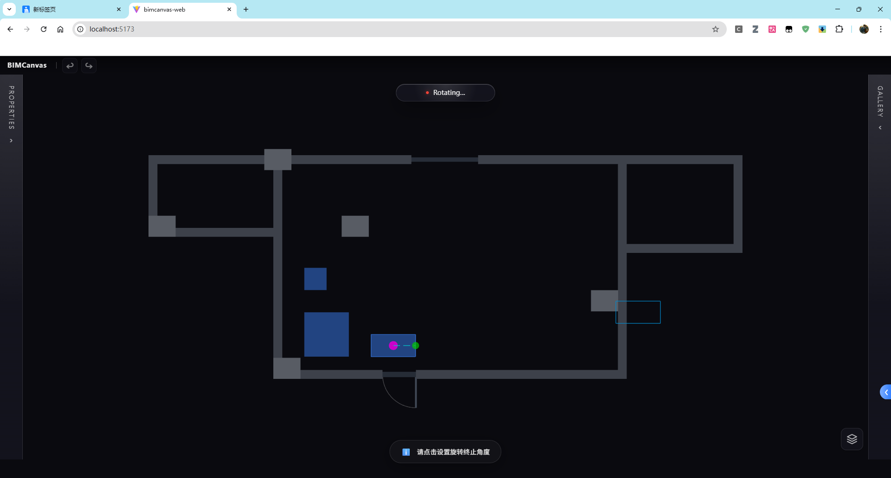

# Bug 报告：旋转命令 Ghost 预览初始位置错误

**报告日期**: 2025-12-21
**严重程度**: 高
**状态**: 未解决
**影响模块**: `BIMCanvas.Web/src/services/interaction/`

---

## 1. 问题描述

### 1.1 现象

在旋转命令中，Ghost 预览轮廓的初始位置与原始模块不重合。

| 功能 | 预期行为 | 实际行为 |
|------|----------|----------|
| 移动命令初始位置 | Ghost 与原模块重合 | ✅ 正确 |
| 旋转命令初始位置 | Ghost 与原模块重合 | ❌ **错误** - Ghost 偏移到其他位置 |
| 旋转方向 | 跟随鼠标移动方向 | ✅ 正确 |
| 旋转距离 | 与鼠标移动距离匹配 | ✅ 正确 |
| 轮廓形状 | 保持矩形不变形 | ✅ 正确 |

### 1.2 截图证据

> **注意**: 请将截图保存到 `reports/screenshots/rotate_ghost_position_bug.png`



**截图说明**：
- 界面状态: "Rotating..."
- 底部提示: "请点击设置旋转终止角度"
- 洋红色圆点: 旋转中心标记（位于模块群组中心）
- 青色矩形轮廓: Ghost 预览（**位置明显偏移**）
- 蓝色实心方块: 原始选中的模块
- Ghost 轮廓应该覆盖在蓝色模块上，但实际显示在右下方远离原模块的位置

---

## 2. 复现步骤

1. 打开 BIMCanvas Web 应用
2. 选择一个或多个家具模块（蓝色方块）
3. 按 `R` 键进入旋转工具
4. **观察**: Ghost 轮廓立即出现，但位置与原模块不重合
5. 点击设置旋转中心
6. 点击设置起始角度
7. **观察**: 进入旋转预览阶段，Ghost 仍然在错误位置

---

## 3. 相关代码文件

| 文件 | 职责 |
|------|------|
| `GhostManager.ts` | 管理 Ghost 预览对象的创建、位置、旋转 |
| `RotateTool.ts` | 旋转工具状态机，调用 GhostManager |
| `MoveTool.ts` | 移动工具，调用 GhostManager（作为对比参考） |
| `SceneBuilder.ts` | 创建模块 Mesh，定义坐标系 |

---

## 4. 代码架构分析

### 4.1 GhostManager 核心方法

```typescript
// GhostManager.ts
createGhosts(originals)   // 创建 Ghost 预览
setPositionOffset(offset) // 移动预览（MoveTool 使用）
setPivot(pivot)           // 设置旋转中心（RotateTool 使用）
setRotation(rotation)     // 设置旋转角度
```

### 4.2 模块坐标系特性

```typescript
// SceneBuilder.ts - createModuleMesh()
const mesh = new THREE.Mesh(geometry, material);
mesh.rotation.x = -Math.PI / 2;  // Y-Up 翻转
// mesh.position 从不设置，默认 (0,0,0)
```

**关键特性**：
- `mesh.position = (0, 0, 0)` - 模块位置始终为原点
- 几何体顶点直接包含世界坐标（来自 bounds 数据）
- `rotation.x = -π/2` 将 XY 平面翻转到 XZ 平面

### 4.3 MoveTool vs RotateTool 调用差异

**MoveTool**（正确）:
```typescript
activate() {
    ghostManager.createGhosts(objects);
    // 不调用 setPivot
}
onMouseMove() {
    ghostManager.setPositionOffset(delta);
}
```

**RotateTool**（错误）:
```typescript
startRotateOperation() {
    ghostManager.createGhosts(objects);
    // 之前在这里调用 setPivot - 已删除
}
onMouseDown(waiting_start) {
    ghostManager.setPivot(centerPoint);  // 现在在这里调用
    state = 'waiting_end';
}
onMouseMove(waiting_end) {
    ghostManager.setRotation(deltaRotation);
}
```

---

## 5. 已尝试的修复方案

### 5.1 方案 1：修改 createGhosts() 初始位置

**修改内容**：
```typescript
// 之前
ghostGroup.position.copy(geometryCenter);
clone.position.set(-geometryCenter.x, -geometryCenter.y, -geometryCenter.z);

// 修改后
// ghostGroup.position 保持 (0,0,0)
// clone.position 保持原样
```

**结果**: 移动预览正确了，但旋转预览仍然错误

### 5.2 方案 2：延迟 setPivot() 调用时机

**修改内容**：
- 删除 `startRotateOperation()` 中的 `setPivot()` 调用
- 删除 `waiting_center` 阶段 `onMouseDown` 中的 `setPivot()` 调用
- 在 `waiting_start` → `waiting_end` 转换时调用 `setPivot()`

**结果**: 旋转预览初始位置仍然错误

### 5.3 方案 3：修改 setPivot() 偏移计算

**修改内容**：
```typescript
// 尝试使用 geometryCenter 计算偏移
clone.position = geometryCenter - pivot
```

**结果**: 未能解决问题

---

## 6. 数学分析

### 6.1 理论计算

对于 Three.js 对象变换：
```
世界位置 = ghostGroup.position + R(ghostGroup.rotation) × (clone.position + R(clone.rotation) × 顶点)
```

**初始状态** (createGhosts 后):
- `ghostGroup.position = (0, 0, 0)`
- `clone.position = (0, 0, 0)`
- `clone.rotation.x = -π/2`（继承自 original）
- 世界位置 = 顶点坐标 ✓

**setPivot(pivot) 后**:
- `ghostGroup.position = pivot`
- `clone.position = -pivot`
- 世界位置 = pivot + (-pivot) + 顶点 = 顶点 ✓

**理论上数学是正确的**，但实际显示位置错误。

### 6.2 可能的坐标系不一致

| 来源 | 计算方法 | Z 坐标处理 |
|------|----------|------------|
| `boundsCenterToWorld()` | 从 2D bounds 计算 | `Z = -centerY` |
| `Box3.setFromObject()` | 从 3D 几何体计算 | 已转换 |
| `setPivot()` | 使用 `boundsCenterToWorld` 结果 | 可能不一致 |

---

## 7. 待排查方向

### 7.1 坐标系差异

1. `RotateTool.calculateGroupCenter()` 使用 `boundsCenterToWorld(obj.bounds)`
2. `GhostManager.createGhosts()` 使用 `Box3.setFromObject(original).getCenter()`
3. 两者计算的中心点可能不同（特别是 Y 坐标）

### 7.2 BoxHelper 行为

1. `BoxHelper.update()` 在什么条件下会导致位置偏移？
2. BoxHelper 是否正确跟踪 clone 的世界变换？

### 7.3 变换矩阵更新

1. `updateMatrixWorld(true)` 是否正确传播到所有子对象？
2. clone 的 rotation 是否影响 position 的世界坐标计算？

### 7.4 克隆行为

1. `original.clone()` 是否深拷贝了所有变换属性？
2. geometry 是否被正确共享/复制？

---

## 8. 调试建议

### 8.1 添加调试日志

```typescript
// GhostManager.ts - createGhosts()
console.log('[Ghost] original.position:', original.position.toArray());
console.log('[Ghost] geometryCenter:', geometryCenter.toArray());
console.log('[Ghost] clone.position:', clone.position.toArray());

// GhostManager.ts - setPivot()
console.log('[Ghost] pivot:', pivot.toArray());
console.log('[Ghost] ghostGroup.position:', ghostGroup.position.toArray());
console.log('[Ghost] clone.position after:', clone.position.toArray());

// RotateTool.ts - calculateGroupCenter()
console.log('[Rotate] centerPoint:', this.centerPoint.toArray());
```

### 8.2 可视化调试

1. 在 Ghost 位置添加一个红色球体标记
2. 在 geometryCenter 位置添加一个绿色球体标记
3. 在 pivot 位置添加一个蓝色球体标记
4. 对比三者位置差异

### 8.3 对比 MoveTool

MoveTool 使用相同的 `createGhosts()` 但不调用 `setPivot()`，且工作正常。
关键问题应该在 `setPivot()` 方法中。

---

## 9. 临时解决方案

如果需要紧急修复，可以考虑：

1. **方案 A**: 禁用 Ghost 预览，直接旋转原模块
2. **方案 B**: 使用与 MoveTool 相同的位置更新逻辑，不使用 setPivot/setRotation

---

## 10. 参考资料

- Three.js Object3D 文档: https://threejs.org/docs/#api/en/core/Object3D
- Three.js BoxHelper 文档: https://threejs.org/docs/#api/en/helpers/BoxHelper
- 项目坐标系说明: `docs/Architecture.md`

---

## 附录：关键代码片段

### A. GhostManager.createGhosts() 当前实现

```typescript
public createGhosts(originals: THREE.Object3D[]) {
    this.removeAllGhosts();
    const ghostColor = 0x00aaff;

    for (const original of originals) {
        const id = original.userData?.id;
        if (!id) continue;

        // 计算几何中心
        const bbox = new THREE.Box3().setFromObject(original);
        const geometryCenter = new THREE.Vector3();
        bbox.getCenter(geometryCenter);

        // Ghost Group 保持在原点
        const ghostGroup = new THREE.Group();
        ghostGroup.userData.geometryCenter = geometryCenter.clone();
        // ghostGroup.position 保持 (0,0,0)
        this.scene.add(ghostGroup);

        // 克隆对象，保持原始变换
        const clone = original.clone();
        // clone.position 保持原样 (0,0,0)
        ghostGroup.add(clone);

        // 创建 BoxHelper
        const boxHelper = new THREE.BoxHelper(clone, ghostColor);
        ghostGroup.add(boxHelper);

        // ...
    }
}
```

### B. GhostManager.setPivot() 当前实现

```typescript
public setPivot(pivot: THREE.Vector3) {
    this.sharedPivot = pivot.clone();

    for (const [_id, ghostGroup] of this.ghostGroups) {
        const geometryCenter = ghostGroup.userData.geometryCenter as THREE.Vector3;
        if (!geometryCenter) continue;

        ghostGroup.rotation.set(0, 0, 0);
        ghostGroup.position.copy(pivot);

        ghostGroup.children.forEach(child => {
            if (!(child instanceof THREE.BoxHelper)) {
                child.position.set(-pivot.x, -pivot.y, -pivot.z);
            }
        });

        ghostGroup.updateMatrixWorld(true);

        ghostGroup.children.forEach(child => {
            if (child instanceof THREE.BoxHelper) {
                child.update();
            }
        });
    }
}
```

### C. RotateTool.calculateGroupCenter()

```typescript
private calculateGroupCenter(): THREE.Vector3 {
    if (this.selectedObjects.length === 0) {
        return new THREE.Vector3(0, 0, 0);
    }

    let sumX = 0, sumZ = 0;
    for (const obj of this.selectedObjects) {
        if (obj.bounds) {
            const center = boundsCenterToWorld(obj.bounds);
            sumX += center.x;
            sumZ += center.z;
        }
    }
    return new THREE.Vector3(
        sumX / this.selectedObjects.length,
        0,
        sumZ / this.selectedObjects.length
    );
}
```

### D. boundsCenterToWorld()

```typescript
export function boundsCenterToWorld(bounds: Polygon2D, height: number = 0): THREE.Vector3 {
    let minX = Infinity, minY = Infinity, maxX = -Infinity, maxY = -Infinity;
    bounds.forEach(p => {
        minX = Math.min(minX, p[0]);
        minY = Math.min(minY, p[1]);
        maxX = Math.max(maxX, p[0]);
        maxY = Math.max(maxY, p[1]);
    });
    const centerX = (minX + maxX) / 2;
    const centerY = (minY + maxY) / 2;
    return new THREE.Vector3(centerX, height, -centerY);  // 注意 Z = -centerY
}
```
