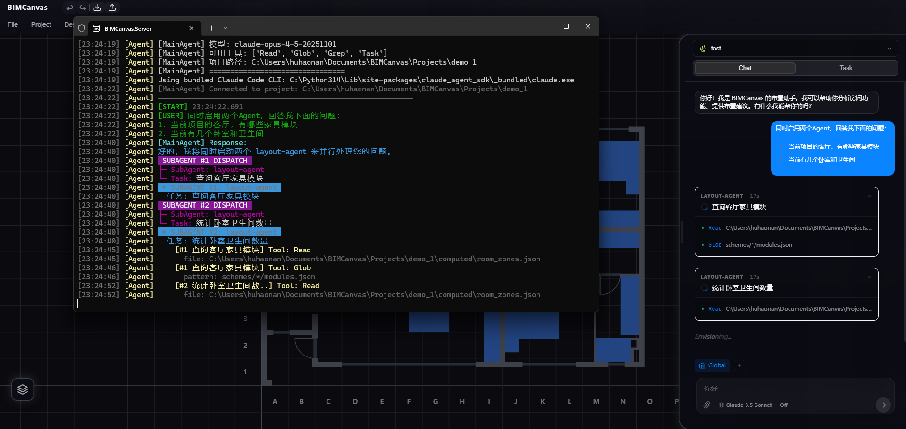
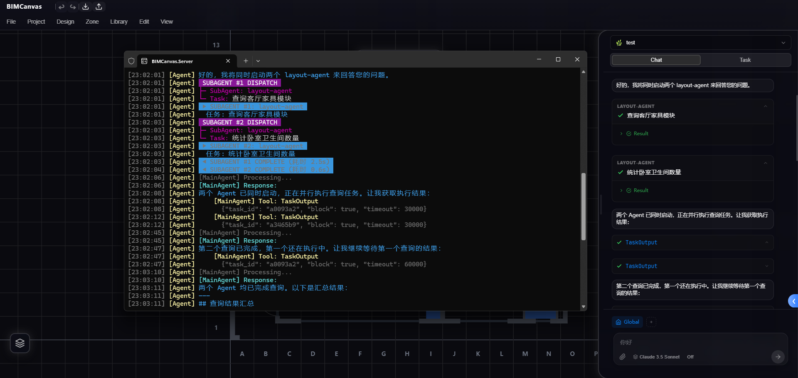

# SubAgent 后台执行与 TaskOutput 工具研究报告

**报告日期**: 2026-01-08（初稿）→ 2026-01-09（深度研究更新）
**问题级别**: 中等
**状态**: 研究完成，待优化

---

## 1. 问题现象

### 1.1 同步执行（预期行为）

SubAgent 执行时，前端显示完整的工具调用过程：

```
LAYOUT-AGENT
├── ✓ 查询客厅家具模块
│   ├── Tool: Read (room_zones.json)    ← 显示工具调用
│   ├── Tool: Glob (schemes/*/modules.json)
│   └── Result: 找到 3 件家具
```

**日志特征**：
- 可用工具：`['Read', 'Glob', 'Grep', 'Task']`
- SubAgent 完成时间：52.3s / 29.2s（实际执行时间）

### 1.2 后台执行（异常行为）

SubAgent 内部没有工具调用显示，出现 `TaskOutput` 工具调用：

```
LAYOUT-AGENT
├── ✓ 查询客厅家具模块
│   └── > Result                     ← 只有结果，无工具调用

[MainAgent] Tool: TaskOutput         ← 主 Agent 调用 TaskOutput
    {"task_id": "a0093a2", "block": true, "timeout": 30000}
```

**日志特征**：
- 可用工具：`默认全开`
- SubAgent "完成"时间：2.5s / 0.6s（**假象！实际任务还在后台运行**）

### 1.3 截图证据

| 同步执行 | 后台执行 |
|---------|---------|
|  |  |
| 显示 SubAgent 内部工具调用 | 只显示 Result，出现 TaskOutput 工具 |

---

## 2. 核心机制分析

### 2.1 Task 工具的两种执行模式

| 模式 | 触发条件 | 行为 |
|------|---------|------|
| **同步** | TaskOutput 工具不可用 | 阻塞主 Agent，等待 SubAgent 完成 |
| **后台** | TaskOutput 工具可用 | 异步执行，立即返回 task_id |

**关键发现**：Claude 根据 **TaskOutput 工具是否可用** 来决定执行模式。

### 2.2 TaskOutput 工具工作原理

**TaskOutput 不是事件通知，而是阻塞轮询**。

时间线分析：
```
23:02:01  Task #1 派发（查询客厅家具）
23:02:03  Task #2 派发（统计卧室卫生间）
23:02:03  ◀ SUBAGENT #1 COMPLETE (2.5s)  ← 假完成事件！
23:02:04  ◀ SUBAGENT #2 COMPLETE (0.6s)  ← 假完成事件！
23:02:08  TaskOutput(task_id="a0093a2", block=true, timeout=30000)  ← 开始等待
23:02:12  TaskOutput(task_id="a3465b9", block=true, timeout=30000)
23:02:45  Response: "第二个完成，第一个还在执行"  ← 37秒后返回
23:02:47  TaskOutput(task_id="a0093a2", timeout=60000)  ← 再次轮询
23:03:10  Response: "两个都完成"
```

**工作流程**：
```
Claude 调用 TaskOutput(block=true)
        ↓
Claude Code CLI 内部阻塞等待
        ↓
返回结果：
  - 任务完成：返回 { result, usage, duration_ms }
  - 任务超时：返回当前状态（可能为空）
```

### 2.3 配置导致的行为差异

| 配置 | tools 值 | TaskOutput 可用 | 执行模式 |
|------|---------|----------------|---------|
| 显式限制 | `["Read", "Glob", "Grep", "Task"]` | ❌ | 同步 |
| 全开 | `null` 或 缺失 | ✅ | 可能后台 |

**根因**：用户配置文件缺少 `tools` 字段，`load_tools()` 返回 `None`（默认全开）。

---

## 3. 研究结论与共识

### 3.1 ~~废弃的方案~~

以下方案**不采用**：

| 方案 | 原因 |
|------|------|
| ~~修改 loader.py 区分配置~~ | 过度工程化，不解决根本问题 |
| ~~修改 main_agent.py 选择工具~~ | 同上 |
| ~~通过配置禁用 TaskOutput~~ | 治标不治本，后台执行是有价值的功能 |

### 3.2 达成的共识

1. **后台执行是有价值的功能**，不应该简单禁用
2. **默认应该同步执行**，只有用户明确要求才后台执行
3. **前端渲染逻辑需要优化**，正确展示后台任务状态
4. **通过系统提示词控制行为**，而非硬编码工具限制

### 3.3 推荐的修复方向

#### 方向 1：修改系统提示词

在 `BIMCANVAS.md` 中添加：

```markdown
## SubAgent 执行策略

- **默认使用同步模式**：启动 SubAgent 后，等待其完全完成再继续
- **不要主动使用后台执行**：除非用户明确要求"后台执行"或"不等待"
- **不要使用 TaskOutput 工具**：除非用户明确要求后台任务
```

#### 方向 2：优化前端渲染逻辑

当前问题：TaskOutput 被当作普通工具调用显示

推荐方案：
1. 新增 `background_task` 气泡类型
2. Task 后台启动 → 创建后台任务气泡
3. TaskOutput 调用 → 更新状态"获取结果中..."
4. 结果返回 → 完成状态

代码位置：
- Agent 端：`main_agent.py:532-550`
- 前端：`AICommandCenter.vue:663-675`

---

## 4. 待验证的问题

| 问题 | 状态 | 验证方法 |
|------|------|---------|
| 后台任务启动时是否有事件？ | ✅ 已验证：有 `subagent_start` | 日志 |
| 后台任务"完成"事件是真的吗？ | ⚠️ 是假的（2.5s） | 日志对比 |
| 后台工具调用是否流式返回？ | ❌ 不返回 | 截图对比 |
| TaskOutput 是轮询还是推送？ | ✅ 阻塞轮询 | 时间线分析 |
| SDK 消息流是否包含后台内部消息？ | ❓ 待验证 | 添加调试日志 |
| Hooks 是否在后台执行时触发？ | ❓ 待验证 | 添加 Hook 测试 |

---

## 5. 相关文件

| 文件路径 | 说明 |
|---------|------|
| `BIMCanvas.Agent/src/config/loader.py` | 配置加载器 |
| `BIMCanvas.Agent/src/agent/main_agent.py` | 主 Agent 实现 |
| `BIMCanvas.Web/src/components/UI/AICommandCenter.vue` | 前端聊天组件 |
| `~/Documents/BIMCanvas/config.json` | 用户配置文件 |
| `~/Documents/BIMCanvas/BIMCANVAS.md` | 系统提示词 |
| `docs/Agent_SDK/docs/TypeScript SDK.md` | SDK 文档 |

---

## 6. 参考资料

- [Feature Request: Background Agent Execution](https://github.com/anthropics/claude-code/issues/9905)
- [Bug: Background subagent tool calls exposed](https://github.com/anthropics/claude-code/issues/14118)
- [Bug: Parallel Task agents lose output](https://github.com/anthropics/claude-code/issues/14055)
- [Subagents Documentation](https://code.claude.com/docs/en/sub-agents)

---

## 7. 附录：相关 Git 提交

```
6407fdf 功能：支持 tools 配置为空时默认全开
de47b81 修复：Agent 工具配置改用 tools 参数实现真正限制
2473b5c 重构：Agent 配置系统改造（硬编码 → 配置文件驱动）
```
